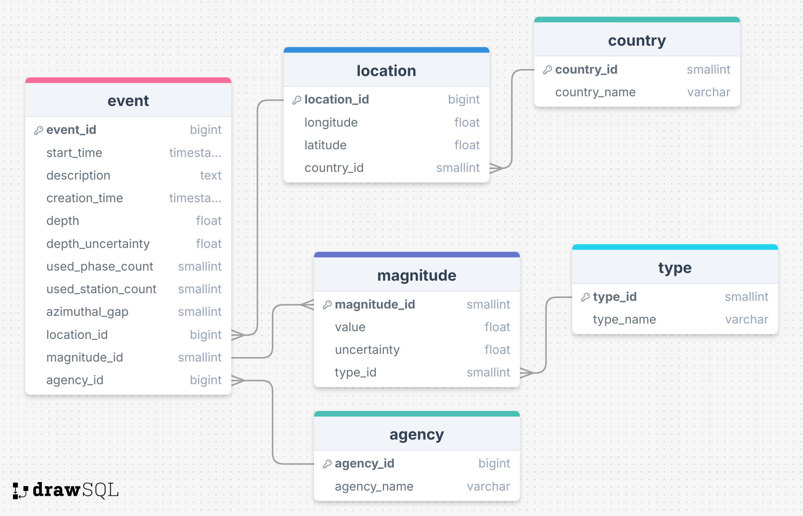
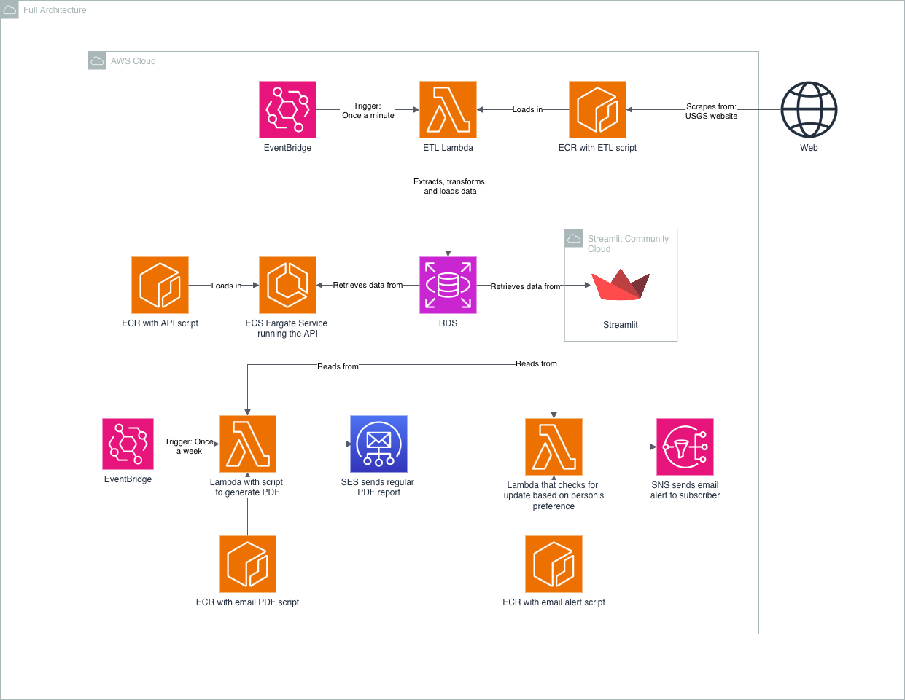

# Earthquakes Data Pipeline 🌋

A fully-functioning, end-to-end ETL pipeline and dashboard which cleans, transforms, and analyses real-time event data of earthquakes around the world. 

## Introduction 🌷

The world is not as stable as we all might wish. There are regular earthquakes globally — most small, but some causing significant damage and danger to life. Knowing about earthquakes, both in advance and historically, can save lives.

This project utilises the United States Geological Survey (USGS) earthquake data feeds to provide useful information and analytics to both technical and non-technical users. The project continually extracts and stores data, which is used in an interactive dashboard as well as an API. Additionally, there is an option for users to subscribe to alerts for earthquakes based on their preference of location or magnitude.

## Project Outputs 🗻
- An ETL pipeline which extracts from the data source and outputs clean, transformed data into an RDS.
- A real-time API for technical users to access earthquake data.
- A Streamlit dashboard which allows non-technical users to query historical earthquake data.

## Project Structure 📂

```text
├── pipeline/
│   ├── extract.py
│   ├── transform.py
│   ├── load.py
│   └── pipeline.py
│
├── database/
│   ├── run_db.sh
│   ├── schema.sql
│   ├── seed.py
│
├── dashboard/
│   ├── app.py
│   ├── components/
│       ├── filters.py
│
├── app/
│   ├── app.py
│
├── alerts/
│   ├── poll_services.py
│   ├── preferences.py
│   ├── formatting.py
│   ├── sns_client.py
│   ├── handler.py
│
├── weekly_report/
│   ├── index.html
│   ├── data.py
│   ├── generate_pdf.py
│   ├── ses_helper.py
│   ├── report.py
│
└── terraform/
    └── main.tf
```

## Getting Started 🏁

Firstly, you must be signed into AWS. Ensure you have the [aws command line](https://aws.amazon.com/cli/) installed on your local machine, and then run the command `aws login`. This should open an AWS window on your default browser, and you should select the account to authenticate.

You must have an `.env` file with the following variables

```
AWS_ACCESS_KEY=XXXX
AWS_SECRET_KEY=XXXX

DB_USERNAME=XXXX
DB_PASSWORD=XXXX
DB_HOST=XXXX
DB_NAME=XXXX
DB_PORT=XXXX
API_KEY=XXXX

```

## Architecture Diagram & ERD 🧩





## Data Source 📊
The data source used in this project is the [USGS Earthquakes feed](https://tools.sigmalabs.co.uk/api/plants/8).

Ⓒ The Tremolytics Team (Basil, Emma, Fariha, Jordan) 🌋